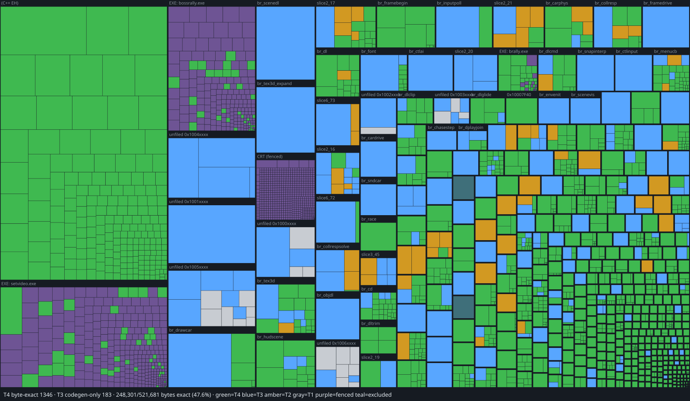

# Boss Rally - a bit-exact decompilation from Jeffrey Wilbur (StrutB)

## Purpose

A complete, bit-exact decompilation of Boss Rally (PC, 1999) — and of Top Gear
Rally where the two share code — held to the MAME standard: the C source is the
single source of truth, and it must compile to **byte-identical output** under
the original compiler (MSVC 5.0) while also cross-compiling cleanly to modern
platforms. One tree, two build targets, the SM64 model. The result is meant to
be both a verified record of the original binary and a portable, platform-
agnostic source you can build and run today. Playability is a consequence of
getting the transcription right, never a reason to reorder the work; progress is
measured only in per-function byte-identical equivalence.

## The two games

Boss Game Studios built *Top Gear Rally* for the Nintendo 64 in 1997 (published
by Kemco, under the licensed *Top Gear* name), then shipped *Boss Rally* for
Windows in 1999 under their own name. They are the same engine. The PC build
still emits **N64 F3DEX display lists**, ships N64-format textures (`.ci4` /
`.lut4`) and big-endian car geometry verbatim off the disc, and carries the same
function-scoped diagnostic strings as the ROM. The N64 ROM is therefore read
here as a second witness to the same logic rather than decompiled in parallel —
nothing from it is transcribed into the tree. The PC game ships two renderer
DLLs over one shared core: `BRGlide.dll` (3dfx Glide, the mature target and the
reference for renderer code) and `BRD3D.dll` (Direct3D, which statically links
~100 KB of CRT that has to be identified and fenced off).

## Status (2026-08-25)

The matching pipeline is live end to end: MSVC 5.0 runs under Wine, and each
source file is compiled and diffed function-by-function against bytes extracted
from the original DLL. Half of the game's `.text` is transcribed into C across
1,103 functions, and 519 of those now reproduce the original bytes exactly --
driven by a growing dictionary of proven compiler idioms
(`docs/VC5-IDIOMS.md`), a Ghidra-assisted batch decompilation pipeline whose
`--refine` hill-climb encodes ten of those idioms as automatic source
transforms, and a structural audit (`tools/sigaudit.py`) that flags which
near-misses are idiom-fixable rather than allocator noise. As of 2026-08-25
the loop runs unattended: a wide `--refine` batch grinds every open candidate
(crash-safe, zero-cost reruns), `tools/autofile.py` files each machine-found
match into the tree, verifies it with a single-file sweep, and commits it,
and a divergence classifier groups every failure by wall type so hand work
starts at "which idiom class is biggest" (`--residue`). Seven of today's
eight new matches were found, filed, and committed by that loop — six of
them a family blocked only by a fused 16-byte *linker* preamble no C source
can produce, now enumerated in `config/preambles.csv`, byte-verified
verbatim, and matched at the true body start. The matched set still skews small
(median 35 bytes); the 44 functions over 1 KB hold 23% of all code bytes and
are where the campaign is decided. The second-largest function (`0x1000EAF0`,
9,264 bytes in `br_scenedl.c`) broke through its main float-scheduling wall on
2026-08-25 and is down to 18 divergence regions from 29. Separately, the
macOS/Metal port of that same source boots, renders the front end from the
game's own artwork, parses tracks, draws retail car geometry through Metal,
and runs the physics integrator with collision response wired in; 137 test
suites pass. The per-frame race render is the last major gate.

| Aspect | Measure | |
|---|---|---|
| Transcribed into C | 241,020 / 480,853 bytes of `.text` · 1,103 / 2,818 mapped functions | `██████████░░░░░░░░░░` 50% |
| **Byte-exact under MSVC 5.0** | 519 of 1,103 transcribed functions · 30,880 bytes | `█████████░░░░░░░░░░░` 47% |
| Byte-exact, of all `.text` | 30,880 / 480,853 bytes | `█░░░░░░░░░░░░░░░░░░░` 6% |
| Race-render frontier | 42 / 50 direct callees of `0x10011FA0` drained | `█████████████████░░░` 84% |
| Port milestones | 3 of 7 done (boot, front end, in-screen navigation); 3 partial | `████████░░░░░░░░░░░░` 43% |
| Port test suites | 137 / 137 green | `████████████████████` 100% |

The second and third rows are the ones that count; everything else is
diagnostics. They tell the same story from opposite ends: nearly half of the
transcribed functions are exact, but the exact set is small-function-heavy, so
by raw bytes the campaign is just getting started.

One denominator note: many of the 2,818 mapped entries are 16 bytes or smaller
-- import thunks, jump stubs and exception-handling scaffolding the original
toolchain generated, not code anyone wrote. Those are reproduced by the link
stage of the rebuild, not by matched C, so the realistic hand-matching target
is smaller than the full map. The formal fence list for that class is still
being drawn up; until it lands, the conservative 2,818-function denominator
stands in the table above.

Both denominators move as work lands, so the percentages are not monotonic. A
function only enters the measured set once it carries an `@implements` claim,
and a sweep of one long-untagged module can add more to the denominator than to
the numerator — coverage counted honestly, not a regression. Read the absolute
count alongside the percentage.

Regenerate with `python3 tools/match_sweep.py` → `build/match/report.csv`. Every
run merges its results back, so the normal case is a single file
(`python3 tools/match_sweep.py src/core/<file>.c`, a few seconds, and it prints
the tree total too); the whole-tree sweep is bookkeeping, not part of the work
loop.

`python3 tools/progressmap.py --svg docs/progress-map.svg` renders the same
data as a treemap — every known Glide function as a tile sized by its original
bytes, grouped by module: green byte-exact, amber tagged with diffs remaining,
gray untranscribed. The interactive version is `build/match/map.html`; hover a
tile for name, VA, size and diff count.

## Building

**`./build.sh`** builds the port target: the whole decomp compiled with clang,
every test binary, and `build/brally` — the full core linked into one runnable
macOS binary, with unported functions satisfied by counted stubs that report at
exit which ones a run actually reached. Modules and tests are *discovered*, not
listed; dropping a `.c` into `src/core/` and its test into `tests/` is enough.
Needs only clang and the macOS SDK. `./tools/regress.sh` runs every suite.

**`./setup.sh`** stages the matching build, entirely inside the repo — nothing
is installed onto the host, and deleting `tools/wine/`, `tools/msvc5/` and
`orig/` puts the machine back exactly as it was. It downloads a pinned,
checksummed portable Wine build, copies the MSVC 5.0 compiler, headers and
libraries out of a Visual C++ 5.0 disc image, extracts the game binaries from
the Boss Rally disc (and the N64 soundtrack from the Top Gear Rally ROM, if
present), and extracts the original function bytes from the game DLL.

Setup needs the following, all supplied by you and none of them tracked in git.
These are the exact dumps the match counts were produced against — `setup.sh`
checks the MD5s and warns if a different image is in `reference/`:

    reference/msvc/VCPP-5.00.iso                  Visual C++ 5.0 disc image
    reference/brally/BossRally.BIN                retail PC disc
        MD5  31c64f9b1e09788c2dfc384b44af8f6c     616,572,096 bytes (MODE1/2352)
    reference/brally/BossRally.cue                cue sheet (data + 12 audio tracks)
        MD5  a48a4a5860558177c3041afee57e03c9     622 bytes
    reference/tgrally/Top Gear Rally (USA).z64    Top Gear Rally ROM (optional)
        MD5  6f7030284b6bc84a49e07da864526b52     8,388,608 bytes (big-endian, NGRE)

plus Rosetta 2 on Apple Silicon, since the Wine build is x86_64. `setup.sh`
pulls `BRD3D.dll`, `BRGlide.dll` and the other game binaries out of the BIN
into `orig/` — do not copy them by hand. Assets are extracted from the same
images and never committed or redistributed; without them the tree still
builds and the suites that need retail data skip with a reason.

Then **`sh build_match.sh`** compiles with the original compiler and diffs. Each
function reports MATCH or DIFF with a hex dump of the first divergence. Matched
functions can be patched back into the original DLL with `tools/pe_patch.py` to
produce a hybrid binary for drop-in testing.

## Architecture

The original already had the seam this project needs: two renderer DLLs over one
platform-agnostic core. The tree keeps that shape.

    src/core/         the decomp — matching C, shared by BOTH build targets
      startup/  driving/  drawing/  racing/  menus/  geometry/
      scene/    gamedata/ settings/ controls/ audio/
      *.c             unfiled address-batch modules (sliceN_MM.c), being retired
    src/backends/
      d3d/  glide/  win32/    original platform calls (matching build)
      metal/  macos/          the macOS port
    include/  tests/  tools/  config/  asm/  orig/

`src/core/` is the deliverable. It holds no platform code and no host
assumptions, so the same file feeds MSVC 5.0 for verification and clang for the
port. Anything that differs between the two original builds — roughly 73
functions — is renderer boundary and lives in `src/backends/`, where Metal is
simply a third backend rather than a fork.

`@implements <addr>` on a function is a hard claim: that function compiles to
byte-identical output under MSVC 5.0, proven by `tools/match_diff.py` against
the extracted original bytes. Passing a port test is not sufficient.

Two structural facts shape the work order. The engine is **dispatch-driven** —
only ~13% of the image is reachable by following `call` from the entry point,
the rest through stored function pointers — so functions are taken leaves-first
from a topological work order rather than by walking the call graph. And
`config/functions.csv` is a good index but not ground truth: it invents entries,
misses others, and records some extents long enough to swallow the following
function.

Further reading: [ARCHITECTURE.md](ARCHITECTURE.md) for the survey the work
order comes from, [CONVENTIONS.md](CONVENTIONS.md) for the coding rules (each of
which has cost real time), and [DECOMP_NOTES.md](DECOMP_NOTES.md) for the
accumulated detail; original bugs that must be preserved, format reversing,
adjudicated conflicts, and the gotchas that bite if forgotten.
