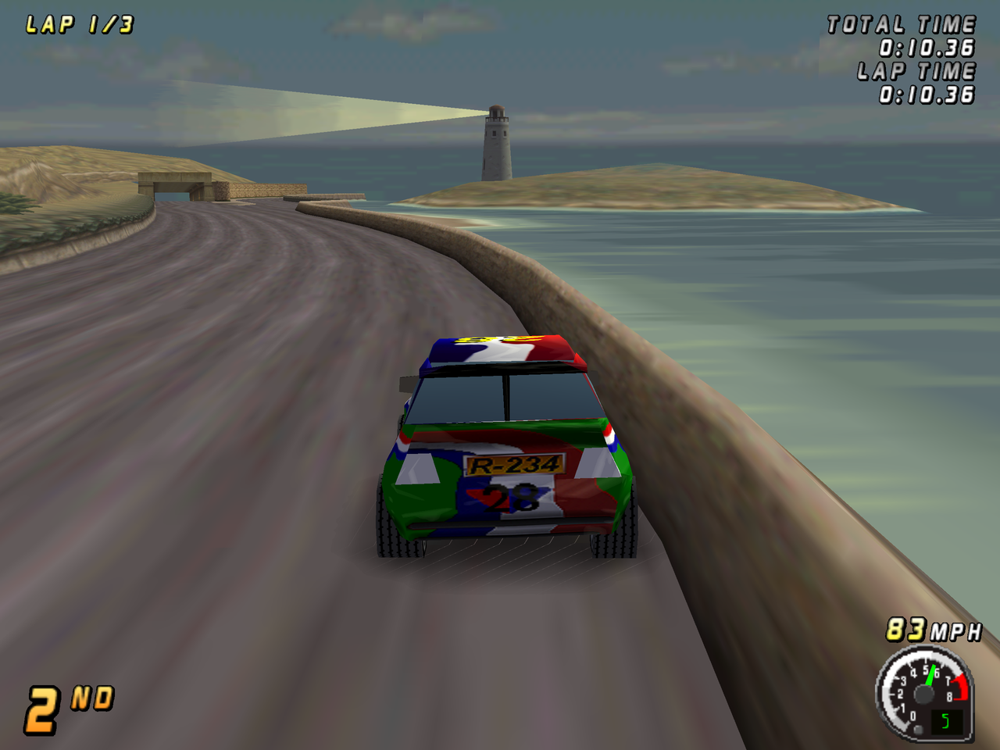
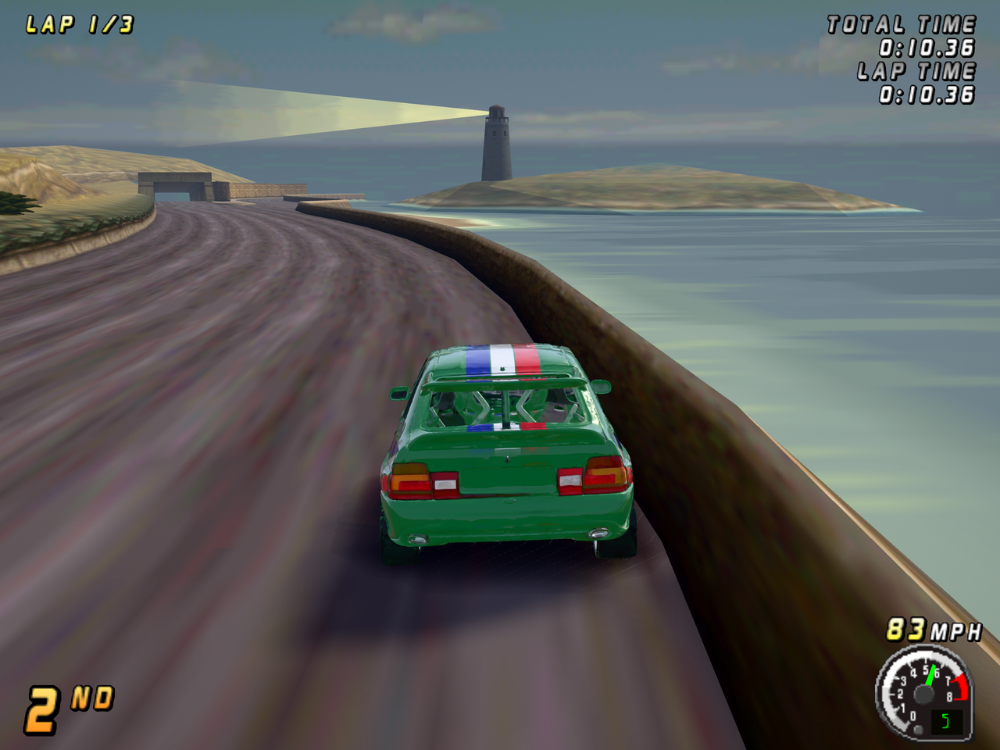

# Boss Rally: bit-exact decompilation

<p>


</p>

*Left: the main menu, running natively on an Apple Silicon Mac ([Mac port](#mac-port)).
Right: Coastline with [Remastered lighting](#remastered-lighting) and the
[Remastered car](#remastered-car) on (press ~ to switch back to the original look).*

**Maintainer:** Jeffrey Wilbur, Strut B, LLC\
**Contact:** [retro@strutb.com](mailto:retro@strutb.com)

## Project Purpose

A bit-exact decompilation of **Boss Rally** (PC, 1999), held to the MAME
standard: the C source is the single source of truth and must compile to
**byte-identical output** under the original compiler (MSVC 5.0), while the same
source also cross-compiles to modern platforms. One tree, two build targets (the
SM64 model). Progress is measured only in per-function byte-identical
equivalence; playability is a consequence, never a reason to reorder matching.
Do keep the port buildable.

## Game background

Boss Game Studios built *Top Gear Rally* for the N64 (1997), then shipped *Boss
Rally* for Windows (1999) on the same engine. The PC build still emits N64 F3DEX
display lists, ships N64-format textures and big-endian geometry off the disc,
and carries the ROM's diagnostic strings. The PC game ships two
renderer DLLs over one shared core: **`BRGlide.dll`** (3dfx Glide: the mature
target and the reference for all matching) and `BRD3D.dll` (Direct3D: statically
links Microsoft's CRT, so it's reference-only, out of scope).

## Two games, two decompilations

It's tempting to assume the N64 game is the PC game compiled for another
machine. It isn't. When the PC source is compiled for the N64 and compared
against the ROM, only about a fifth of the ROM's code has a clear match. At
most around half could turn out to share code with the PC game.

- **Boss Rally is the bigger game.** It has roughly twice as many game
  functions as Top Gear Rally. It's a later game built on the same engine, not
  a straight port.
- **Shared code still changed.** Where a function exists in both games, the
  two usually differ by a few percent of their instructions. Two years of
  edits sit between the 1997 and 1999 releases, so PC source is a strong
  starting point for an N64 function, not a finished answer.
- **Much of the ROM has no PC counterpart.** Around 40% is N64-only code:
  graphics and audio drivers, the front end and other console-specific
  systems. It has to be decompiled from scratch. Another sixth is Nintendo's
  system library and a compression library, which are linked in rather than
  decompiled.

So the N64 game gets its own decompilation, kept apart from the PC tree (see
the Top Gear Rally section at the end). The two still help each other. The
N64 compiler records operand order that the PC compiler throws away. A
matched function on either side is a head start on its twin.

## Cheats

*Boss Rally* was long believed to have **no cheat codes at all**: none are printed
in the manual, and none have ever circulated online. The decompilation turned up a
working cheat system hiding in plain sight: the game quietly keeps the last 32
keys you type, and the instant the tail of what you've typed spells one of six
code words, it fires. There's no cheat menu and no prompt, and there's a catch:
**keys only count while the mouse pointer is resting on the main menu's
"Credits" item.** The key-recording hook belongs to that one menu row and runs only
while the cursor is over it. Typing anywhere else in the menus does nothing, and
neither does moving to Credits with the keyboard or typing into a name box (the
name box reads each key and clears it). Case doesn't matter. A chime confirms the
code. Nothing changes on screen right away: each code just sets a flag, which
shows up later in the car and track selection screens, or when you click Credits.

Each code is a person's first name:

| Code | What it (likely) does |
|---|---|
| `hazel` | Unlocks **all cars** |
| `brielle` | Unlocks the **three bonus cars** (takes the roster from 11 up to 14) |
| `benjamin` | Unlocks **all tracks** |
| `lynette` | Unlocks a **hidden second set of tracks** the menus normally won't show |
| `sophia` | Unlocks the game's **ending sequence** without finishing the championship; clicking Credits then plays it |
| `madeleine` | Cranks a **visual effect** (the "ripple" effect) up to maximum: a novelty toggle, not a gameplay advantage |

The five unlock codes are certain from the code. `madeleine` is the odd one out:
it's clearly a deliberate toggle with its own confirmation sound, and it removes the
cap on how strong the game's ripple effect can get, but exactly how that looks on
screen isn't recoverable from the binary alone, so treat its description as a best
guess pending someone actually typing it in-game.

## Split screen

The N64 game *Top Gear Rally* has a two-player split-screen mode. The PC version
appears to ship with **no way to select it**, yet the decompilation shows the
split-screen renderer is fully present, complete, and wired up. It was built, and
then left one step short of playable.

What's actually in the binary:

- **A complete two-way split renderer.** The frame setup switches on the view
  count with exactly two arms: one full-screen view, or **two stacked
  half-height views** (top and bottom, each clipped to its own half). There is no
  three- or four-way path; it's strictly a two-player top/bottom split.
  (`BrFrameBeginDl`, `src/core/drawing/br_framebegin.c`)
- **A per-view frame loop.** The frame drawer iterates `for (i = 0; i < views; i++)`,
  building each view's own camera and scene, and the camera code halves its height
  "which is what a split screen needs." Every downstream system (HUD, lap-time
  layout, on-screen captions, the "wait for player" prompts) already carries live
  `views == 2` branches. (`BrFrameDraw`, `src/core/drawing/br_framedrive.c`;
  `src/core/scene/br_camera.c`)
- **Generic multi-car control.** Cars are driven by a per-car function pointer;
  AI cars point at the AI controller, and the engine already runs any number of
  independently-controlled cars per frame. The physics don't care whether a given
  car is steered by a human or the AI. (`BrRaceDriverStep`,
  `src/core/racing/br_racestep.c`)

So the screen, the cameras, the HUD, the second car, and the physics are all ready.
The one missing piece is **input for a second local player**:

- Input is a singleton. There is one keyboard buffer and one mouse buffer (the
  `[2]` you see is current/previous-frame double-buffering, not two players), and
  one control layout. (`src/core/controls/br_inputpoll.c`, `br_ctrlquery.c`)
- The routine that applies a player's controls to a car, `BrCtlInputApply`, takes
  a car pointer but reads its input from a **single global** with no device or
  player index: hand it any car and it feeds that car the same one human's input.
  (`src/core/driving/br_ctlinput.c`)

To turn this into a working mode you would need to add a second device binding /
control layout, give the input applier a per-player selector so entrant 0 and
entrant 1 read different devices, assign the second entrant a human controller
instead of the AI one, and expose the mode in a menu. Everything below that (the
hard part, the rendering) is already done.

## Status

Two milestones, both measured in bytes of the game's own functions in
BRGlide.dll: the hand-written target (in-scope EXE game code is separately
complete). The rest of the DLL's code section is itemised under the bars. The block below
is a snapshot; counts move as sessions land matches. Regenerate the bars and the
treemap in one step with `python3 tools/progressbar.py`: do not hand-edit them.

<!-- PROGRESS:BEGIN: generated by tools/progressbar.py; do not edit by hand -->
_Snapshot 2026-09-30._

```
M1  Contract-valid: compiles & ports (T3 + T4)
    ████████████████████████████████████████  100.0%   450,489 / 450,649 B   1,495 / 1,495 fns
M2  Byte-exact (T4)
    ████████████████████████░░░░░░░░░░░░░░░░  59.4%   267,906 / 450,649 B   1,307 / 1,495 fns
```

**What the bars measure.** Both bars count the game's own functions in
BRGlide.dll: the code that has to be written by hand. M1 has complete.
M2 trails it by 188 functions (182,583 B) that are certified to behave exactly like
the original but do not yet compile to identical bytes.

**The rest of the DLL.** Its code section is 480,853 B; the bars leave out 30,204 B
of it, all of which the finished DLL still contains but none of which is
hand-written:

| Bytes | What it is | Where it comes from |
|---:|---|---|
| 20,151 | padding and jump tables between functions | emitted by the compiler with the functions |
| 7,975 | import stubs and C++ exception-handling glue | generated by the compiler and linker |
| 2,078 | 2 functions the retail game never runs | written, but left out of the count (config/excluded.csv) |

By binary: the three EXEs are complete at both milestones (their game code is fully
byte-exact; the static CRT filling out each image is reproduced by linking, not
decompiled, and is out of scope). All remaining work is in BRGlide.dll.

| Area | M1: contract-valid | M2: byte-exact |
|---|---|---|
| **BossRally.exe** | `████████████████████` 100%: 35/35 fns, 2,482 B | `████████████████████` 100%: 35/35 fns, 2,482 B |
| **BRally.exe** | `████████████████████` 100%: 28/28 fns, 2,860 B | `████████████████████` 100%: 28/28 fns, 2,860 B |
| **SetVideo.exe** | `████████████████████` 100%: 42/42 fns, 7,251 B | `████████████████████` 100%: 42/42 fns, 7,251 B |
| **BRGlide.dll** | `████████████████████` 100.0%: 450,489 B, 1,495 fns | `████████████░░░░░░░░` 59.4%: 267,906 B, 1,307 fns |
<!-- PROGRESS:END -->

Query the tree. Do not trust a number in this file.

```bash
.venv/bin/python tools/refcheck.py     # corpus must be Glide-keyed
.venv/bin/python tools/total.py        # byte-exact functions and bytes, all lanes
.venv/bin/python tools/tiers.py        # T1/T2/T3/T4 of the C target (bytes, not just fns)
.venv/bin/python tools/image_build.py  # M2 gate: assembled DLL vs original; must be 0 differing bytes AND 0 refslot findings
.venv/bin/python tools/image_build_t3.py  # M1 gate: T3+T4 all compile & place; only T3 bodies differ
.venv/bin/python tools/brbox_diff.py --all  # M1 behaviour gate: T3 image vs original, every script, every frame
.venv/bin/python tools/fileaudit.py    # WHAT IT DOES, filing, T3 tags
```

`image_build.py` is the Milestone-2 (byte-exact) gate; `image_build_t3.py` is
the Milestone-1 (contract-valid) one: it compiles every T3-certified function
as well and proves the whole corpus builds and places, emitting `BRGlide.T3.dll`.
Its T3 bodies differ in bytes by design, but it is a **working drop-in**: it runs
the retail game (tested in a Win98 VM under 86Box) and behaves identically to
the original on every scripted session (below).

T1 = draft only; T2 = in the tree, not done; T3 = certified complete, not
byte-exact (`tools/t3.py --qualify`); T4 = bytes diff clean.

### How T3 is verified

"Not byte-exact" must still mean "does exactly what the original does". Two
oracles run the **original game** headless (`tools/brbox.py`: the retail
`BRGlide.dll` under Unicorn, driven by input scripts in `tools/brbox_scripts/`:
boot, menus, quick race to the finish, time attack and saves, championship and
season save/load, options and video modes, cheats and credits, a force-feedback
wheel, CD music, and two-machine DirectPlay races with join and dropout):

- **A5: per function** (`tools/t3live.py`, ledger `config/t3_live.csv`): at
  real calls in the running game, the original body and the T3 body run from the
  identical captured state; memory, imports, registers, x87 state and live
  return values must agree. Unreached functions are UNCOVERED, never passed.
- **A7: whole image** (`tools/brbox_diff.py --all`, ledger
  `config/whole_image.csv`): the assembled `BRGlide.T3.dll` and the original run
  every script side by side and must agree on **every frame**: every Glide call
  and its arguments, the whole data area, and every network packet (both
  machines of a network session run the image under test). Currently 26/26
  scripts identical.

A7 exists because A5 alone was not enough: the whole-image run found some 25
real transcription bugs (inverted branches, swapped or wrong arguments,
off-by-one indexing, x87 rounding points, and image-builder relocation errors)
in functions A5 had certified. `t3.py --qualify` requires both, and A7 is never
superseded. Bytes the original itself reads without ever writing (stale stack)
are listed with their evidence in `config/ub_scrub.csv` and neutralised on both
sides. Function counts
overstate progress: remaining functions are several times larger than matched
ones. Quote bytes with their denominator (the hand-written target shown in the
bars, or BRGlide `.text` at 480,853 B: say which).

In-scope EXE game code (BRally.exe, BossRally.exe, SetVideo.exe) is complete;
what remains in those images is statically-linked CRT, reproduced by linking.
C++ EH functions are a separate lane (`tools/cpp_sweep.py`). The Mac port is
described under [Mac port](#mac-port).

A byte-exact session picks targets with `python3 tools/t4lane.py --claim`
(Pool B). Procedure: `docs/MATCHING.md`.

The image gate (`tools/image_build.py`) is the deliverable check a per-function
diff cannot perform: it lays every claim at the address it claims, refuses
overlaps, fills unmatched ranges from the original, and diffs the image.


Every box is one function, sized by its bytes in `.text` and grouped by module:
green = byte-exact (T4, M2), blue = contract-valid but not yet byte-exact (T3),
amber = still diffing (T2), gray = not started (T1), purple = linker/CRT
(fenced). Green + blue is the M1 corpus. Regenerate: `python3
tools/progressmap.py --svg docs/progress-map.svg`.

## Keeping it that way

A function is not done until it says what it does and lives in its module.
`tools/precommit_rule6.py` refuses a commit that adds an `@implements` without
a `WHAT IT DOES:` comment, creates a `sliceN_MM.c`, or adds a new VA to an
existing address batch. `tools/fileaudit.py` is a ratchet across all three
lanes (undescribed 0, batches 58, stranded 11) and fails on a bad `@t3` tag.
After a refile: `python3 tools/portcheck.py --baseline main`: the sweep only
compiles `/DBR_MATCHING_BUILD`. Moving byte-exact code can change it; sweep
both files and keep the move only if nothing regressed.

## Architecture

The repo root is the decomp. `ports/` is derived platform code, not byte-matched.

    src/core/                 portable game logic (byte-matched)
    src/backends/{glide,d3d,win32}   original Win9x platform layer
    src/exe/                  the three Win9x executables (game code done)
    include/  tests/
    tools/                    matching pipeline + staged MSVC 5.0
    config/                   function maps, globals, binaries.csv, fenced.csv
    build/match/              extracted reference bytes, per-function report
    ports/macos/              macOS/Metal port: NEW code, no `@implements`
    n64/                      Top Gear Rally (IDO/MIPS); writes only build/n64/

`@implements <addr>` is a hard claim: MSVC 5.0 emits those original bytes.
The engine is dispatch-driven: only ~13% is reachable by following `call`
from the entry point, so functions are taken leaves-first.

Further reading: [ARCHITECTURE.md](ARCHITECTURE.md), [docs/MATCHING.md](docs/MATCHING.md),
[docs/VC5-IDIOMS.md](docs/VC5-IDIOMS.md), `ports/README.md`.

## Building & Setup

- **`./setup.sh`**: stages the matching build entirely inside the repo (nothing
  installed on the host). Downloads a pinned Wine build, copies MSVC 5.0 out of a
  VC++ 5.0 disc image, and extracts the game binaries and original function bytes
  from the retail disc. Needs (you supply; none tracked in git): `reference/msvc/VCPP-5.00.iso`,
  the Boss Rally disc (`reference/brally/BossRally.BIN` + `.cue`), optionally the
  Top Gear Rally ROM, plus Rosetta 2 on Apple Silicon.

### Reference data (you supply; none tracked in git)

These are the exact dumps the match counts were produced against: `setup.sh`
checks the MD5s and warns if a different image is in `reference/`.  Without
them the tree still builds and the suites that need retail data skip with a
reason, but the matching pipeline cannot run and no byte-exact claim can be
verified.

```
reference/msvc/VCPP-5.00.iso                  Visual C++ 5.0 disc image
reference/brally/BossRally.BIN                retail PC disc
    MD5  31c64f9b1e09788c2dfc384b44af8f6c     616,572,096 bytes (MODE1/2352)
reference/brally/BossRally.cue                cue sheet (data + 12 audio tracks)
    MD5  a48a4a5860558177c3041afee57e03c9     622 bytes
reference/tgrally/Top Gear Rally (USA).z64    Top Gear Rally ROM (optional; the Mac app needs it)
    MD5  6f7030284b6bc84a49e07da864526b52     8,388,608 bytes (big-endian, NGRE)
```

Rosetta 2 is required on Apple Silicon (the Wine build is x86_64). `setup.sh`
pulls `BRD3D.dll`, `BRGlide.dll` and the other game binaries out of the BIN
into `orig/`: do not copy them by hand. Assets are extracted from the same
images and never committed or redistributed; without them the tree still
builds and the suites that need retail data skip with a reason.

- **`sh build_match.sh`**: compiles with the original compiler and diffs; each
  function reports MATCH or DIFF with the first divergence. `tools/pe_patch.py`
  patches matches back into the DLL for drop-in testing.
- **`./build.sh`**: builds the portable core natively with clang, with its unit
  tests and the older partial harness `build/brally`. Modules and tests are
  auto-discovered. `./tools/regress.sh` runs every suite. The playable Mac
  build is separate: see below.

## Mac port

<p>


</p>

*The same moment of a Quick Race on Coastline, Original (left) and
Remastered (right): press ~ to switch between them live.*

The game runs natively on macOS: an arm64 Mac app with a window, Metal
rendering, and the Mac's keyboard, mouse and game controllers. It is rough but
working. It boots through the splash and loading screens to the main menu, runs
the front end (menus, race and car setup, all menu art), and drives races with
the textured track, cars, shadows and HUD on screen, with music and sound
effects: Quick Race, championships through to the race, and the instant
replay of the whole race at the flag. Quitting from the menu, with Cmd-Q or
with the close box exits cleanly.

- **Native resolution.** 3D is projected, clipped and rasterised by the GPU
  at the window's pixel size (2560x1920 in a 1280x960 window on a Retina
  display), not drawn at 640x480 and stretched. The menus' 640x480 art is
  scaled with whole pixels, so it stays crisp.
- **Resize and full screen, live.** Drag the window (it keeps 4:3), use the
  green button, View > Enter Full Screen or Ctrl-Cmd-F; the game redraws at
  the new size without a restart. Above 8 million pixels (full screen on a 5K
  display) it renders at that cap and scales up, to stay inside a frame.
- **Display-paced frames.** The port starts each frame just before the
  display's next refresh and presents 60 frames a second in menus, races and
  replays. The race's 30 Hz simulation is untouched; each picture blends the
  game's snapshots at the moment it reaches the screen. Frame start to screen
  is about 40 ms while macOS composites the window, down from 65 ms.
- **Game controllers.** Any controller macOS supports (Xbox, PlayStation,
  Switch Pro, MFi) appears to the game as a joystick: choose it in the
  game's options and bind it in its Controls menu, as on Windows.
- **PC or N64, on Tab.** Tab switches the game between its PC version and
  its N64 one, live, and the version's icon shows in the top right corner
  for a moment. For now that is the soundtrack: the PC one (the disc's CD
  audio) or the N64 one, with the pieces the N64 game uses for its title
  screen and each race track, looping forever as on the N64. Both play
  every cue at once and a switch crossfades to the other where it has got
  to, so the race's PC track stays the one picked at the start; the choice
  is remembered and the two are level-matched. The game's
  own music logic decides what plays when, as on Windows: the front-end
  track, a random track per race, the next track when one ends, the Options
  jukebox and the next/previous keys. When a race ends the title piece
  comes back (the original leaves the race's track playing under the
  menus).
- **Remastered or Original, on ~.** The ~ key (left of 1) switches live
  between the game as it was and a remastered one: modern lighting,
  photoscanned ground, volumetric smoke, spray, rain and snow, track skies,
  temporal anti-aliasing and motion blur, all following the race's weather;
  every ES drawn as a modern high-detail car; and the N64 soundtrack
  re-recorded with modern instruments. See
  [Remastered lighting](#remastered-lighting),
  [Remastered car](#remastered-car) and
  [Remastered music](#remastered-music).
- **Sound effects.** The menu clicks, the engines, the start countdown and
  the race's hits and scrapes play as on Windows: the game still drives DirectSound, and the
  port mixes its buffers natively (DirectSound's volume, pan and pitch laws)
  and plays them through AVAudioEngine. Checked against the original game
  under brbox, the port starts and stops the same sounds on the same frames.
  Like the original, the effects mute while the app is in the background.
- **A self-contained app.** One command extracts everything the game reads
  from your disc image and ROM (the data track, the CD audio and the N64
  modules) and builds `Boss Rally.app` around it, with the Remastered
  car, skies, ground materials and music when they are on disk. Once
  built, the app needs none of them nor this tree: copy it anywhere and
  open it.

**How it works.** Every function in the verified M1 build (all T3 and T4
bodies) is compiled from the same `src/` tree the byte-exact build uses; no
decomp source is edited for the port. The game is 32-bit to the core: pointers
live in 32-bit fields and the original's data tables hold 32-bit code and data
addresses. So for now the port keeps that model exactly: each module is
compiled to wasm32 (which is ILP32, like Win32), the objects are translated to
C by `ports/macos/wasm/w2c.py`, which also acts as the linker, and that C is
compiled natively for arm64 against a 32-bit address space. The original
DLL's data sits at its original addresses, so every function lands at the
address the verified build gives it and the original's function-pointer tables
work unchanged. A small host layer (`ports/macos/wasm/host/`) answers the
Win32, DirectX, Glide and C runtime calls the game makes:

| Host file | What it stands in for |
|---|---|
| `host_app.m` | `main`, the window, keyboard and mouse, presenting frames |
| `host_glide.m` | Glide on Metal, modelled on the Voodoo: 16-bit W/Z depth, mip levels, filtering, LOD bias |
| `host_fx.m` | Remastered lighting: the G-buffer passes, shadows, ground materials, particles, weather, TAA and motion blur, tonemap and the ~ switch (not a stand-in; port-only) |
| `host_car.m` | the Remastered car: loads its model and draws it in Metal (not a stand-in; port-only) |
| `host_sky.m` | the Remastered skies: picks the track and weather's panorama and decodes it off the render thread (not a stand-in; port-only) |
| `host_win.c` | Win32: files (the disc image as the CD, saves), threads, timers |
| `host_dx.c` | DirectInput, DirectSound, DirectPlay as COM objects in game memory; DirectSound's buffers are mixed for real |
| `host_ear.c` | the EAR 3D sound engine the game loads by name |
| `host_crt.c` | the C runtime |
| `host_script.c` | replays `tools/brbox_scripts/` input scripts, for testing |

A second seam replaces game functions outright: a body in
`ports/macos/wasm/native/` tagged `@replaces 0xVA Name` takes that function's
direct calls and dispatch-table slot, and the build stops if the address is
not in the verified placement. That is how the Mac-native parts plug in:

| Native file | What it replaces |
|---|---|
| `native/frame.m` | the frame swap and the game clock: display-timed pacing |
| `native/render.m` | the display-list triangle leaves: GPU projection and clipping |
| `native/input.m` | reads the Mac's game controller for the DirectInput joystick |
| `native/window.m` | live resizing and full screen |
| `native/music.m` | the CD music backends (MCI and the EAR engine's CD channel): AVAudioEngine for the CD audio, libopenmpt for the N64 modules, the remastered soundtrack under ~, all at once, crossfaded |
| `native/sound.m` | plays the DirectSound mix through AVAudioEngine; replaces the WAV loader's data seek and three sound-bank wrappers the translation could not reach |
| `native/version.m` | the PC / N64 version: Tab, its icon, the remembered choice |
| `native/car.m` | the car draw (0x1000A110) and G_MOVEWORD (0x100239C0): with Remastered on, each ES's display lists are emptied and a marker puts the modern model in their place |
| `native/varblock.c` | the four state-snapshot wrappers (0x100609B0 to 0x10060A10) the translation inlined away, and BrRaceSaveLastLapInfo (0x10060A30): the last-lap snapshot the instant replay starts from, and the pause block's save and restore |

`ports/macos/NATIVE_RENDERER.md` is the design and records what each piece
measured. This 32-bit lane is interim; a native 64-bit port comes later.

### Remastered lighting

An optional modern lighting pass over the game's own picture, switched live
with **~** (the key left of 1). Original is the frame exactly as the game
draws it; Remastered relights that frame on the GPU. The game's rendering,
simulation and display lists are unchanged either way, and nothing under
`src/` is involved. The choice is remembered between launches (the default
is Remastered), a word in the top left corner says which one is on for a
moment after a switch, and the game never sees the key.

What Remastered adds:

- **Sun shadows.** Every opaque triangle the frame drew is drawn again from
  the sun into two shadow cascades, a sharp one around the car and one four
  times wider out to the distance, trees and fences cut out by their
  textures' alpha, and sampled with soft filtering. The sun stays fixed in
  the world as the camera turns.
- **Smooth surfaces with relief.** Normals are averaged across each
  continuous surface (real creases kept), so low-poly shapes stop lighting
  in flat facets, and each texture's own detail becomes bumps that fade
  with distance.
- **Photoscanned ground.** Six CC0 material sets from ambientCG (asphalt,
  grass, ground, gravel, rock, snow) are laid over the game's own colours
  in world space, with their normal, roughness and occlusion maps and
  parallax occlusion close up, so gravel and rock stand out of the surface
  and shadow themselves. Each surface is classified from the game's
  texture and its slope; white and yellow road markings stay. Asphalt
  loses the old textures' baked streaks and purple cast.
- **A map of the road.** The track's collision mesh, the same triangles
  and surface codes the wheels find, is drawn from above once per track,
  so the lighting knows the road in every weather: in snow it is ploughed
  tarmac with packed snow along its edges, and everything else lies under
  snow.
- **Ambient occlusion and bounce light.** Creases, wheel arches and wall
  bases darken, and nearby surfaces tint each other with their colour (one
  bounce, sampled in world space against the frame's own geometry).
- **Wet roads, only when wet.** Dry asphalt is matte: no reflections and
  no sun glints. In the wet, screen-space reflections and sun highlights
  scale with how wet the weather is: a faint sheen in fog, glossy roads in
  rain and storms, and puddles scattered over the track that mirror the
  cars and scenery.
- **Light shafts, bloom and air.** Light scattering from the sky around the
  sun, bright details glowing (lit windows and lamps at night), and distant
  surfaces taking on the colour of sunlit air.
- **Clean, colour-true grading.** A neutral tonemap (Khronos PBR Neutral)
  that leaves colours as they are until the highlights roll off, a colour
  balance per weather (cool and blue at night), and a colour-only filter
  that keeps the 1999 textures' colour speckle from being amplified.
- **Headlights, tail and brake lights.** At night, in storms and in fog
  every car's headlights throw a low-beam pattern on the road and scenery
  ahead of it in real time (a hot spot just under the horizon, a cutoff
  above, wide to the sides), with glints on wet surfaces and beams visible
  in the air. The lamps sit where each car's own model has them, and glow
  when they face the camera and nothing hides them. Tail lights glow dimly
  in the dark; the brake lights come on from the car's own controls as its
  physics applies them (the brake pedal, the handbrake, the grid hold), for
  the player and the computer drivers alike, in any light, with a red glow
  on the road behind.
- **Smoke, dust, spray, rain and snow.** The game's own puffs are replaced:
  each tyre makes smoke from its sideways slip on tarmac and dust (or
  powder in snow) from speed and slip on loose ground, read from the
  game's grip tables, as one volume lit by the sun and sky through its own
  depth. Every wheel throws spray in the wet and splashes through puddles.
  Rain and snow fall as streaks and flakes fixed in the world at four
  layers of distance, rain rings on standing water, and on the Remastered
  car rain beads on the paint and runs down the sides.
- **Tyre tracks.** Each wheel lays a track the lighting reads: pressed
  snow, darkened dirt, dry lines on a wet road.
- **Skies.** A panorama for each track and weather (35 of them) where the
  pack is installed (see [Remastered assets](#remastered-assets)), laid
  out with a photograph's proportions so the clouds are in view while
  driving; otherwise in clear weather a drawn sky with a visible sun and
  soft ray-marched volumetric clouds that drift; the hills and scenery the
  game paints along the horizon are kept. At night a deep-blue sky where
  the game leaves black.
- **Water.** The sea (painted into the game's backdrop or modelled) is
  shaded as moving water: waves that shrink with distance and calm to a
  mirror toward the horizon, the sky reflected with Fresnel falloff, and
  the sun's glitter.
- **Sharper surfaces.** 3D textures are sampled with 16x anisotropic
  trilinear filtering (mip chains generated where the game has none), so
  the road stays crisp into the distance.
- **Temporal anti-aliasing and motion blur, on the scene only.** Every 3D
  triangle is drawn with a sub-pixel jitter and the frames are resolved
  over time, following last frame's camera and each car's own motion, and
  the same motion blurs what moves. Both happen before the game's 2D is
  laid over the scene, so the HUD, text and menus never pass through them.
  A camera cut starts the history afresh.
- **HUD and menus untouched.** Anything the game draws in 2D keeps its
  exact colours.

It follows the race's weather:

| Weather | Look |
|---|---|
| Sunny | clean high-key daylight, crisp shadows filled with sky blue, light shafts, matte dry roads |
| Fog | real fog: distance and sky fade into grey, headlights on with visible beams, a faint damp sheen on the road |
| Storm | dim overcast, rain, wet roads with puddles and ripples, wheel spray, headlights on, lightning flashes light the scene |
| Snow | bright overcast, falling snow, a ploughed road through snow-covered ground, powder off the tyres, cold bounce light off the snow |
| Night | a clear, dry night: moonlight under a deep-blue sky, cool colour balance, headlights lighting the road, tail and brake lights glowing red behind every car, lit windows |

**How it works.** Alongside its colour, each frame now also records every
pixel's position in the world and its surface direction. The positions come
from the game itself: the display-list machine keeps the camera's view and
projection as one matrix, and its inverse takes each triangle corner the
game already projected back into the world (a Z-up world where one unit is
about a metre). At the swap, `host_fx.m` builds the shadow map, occlusion,
reflections, light and bloom from that record and presents the result. The
weather comes from the game's weather variable, and the storm's lightning
from its lightning timer.

**Cost.** About 20 ms of GPU per frame at 2560x1920 with everything on,
driving a Quick Race on Coastline behind the Remastered car on an Apple
Silicon Mac (`BR_GPUTIME=1`), which is more than a 60 Hz frame allows.
`BR_FX_PROF=1` breaks it down by pass. Full screen on a 5K display renders
more pixels and has not been measured.

**Limits.** Only what is on screen can cast shadows or appear in
reflections, since the game draws nothing off screen. The game's textures
and vertex colours already carry its own lighting; Remastered treats them
as the surface colour and lights on top.

### Remastered car

With Remastered on, every 4WD ES in the race (the default Quick Race car)
is drawn as a modern high-detail model of the car it stands for, a
mid-1990s Escort RS Cosworth rally car, instead of its 1999 model; ~ swaps
it back to the original on the next frame, with the rest of Remastered.
Nothing the game does changes: its physics, cameras, matrices and the
other cars are the same either way.

- **Body and wheels separately.** The body (about a million triangles) has
  no wheels; one wheel and tyre (250,000 triangles) is drawn four times on
  the game's own wheel transforms, so the wheels spin, steer and ride the
  suspension exactly as the original's do.
- **Placed by the game's hubs.** The body is scaled and seated so its brake
  discs sit on the game's four wheel hubs, which puts it at the original's
  size, wheelbase and ride height.
- **Paint and livery.** The model is painted one plain green with no badges
  or text; the red, white and blue ribbons are a separate livery texture
  projected onto the painted surfaces only, so a livery can change without
  touching the model.
- **Shading.** Metal and roughness maps, a clear coat on the paint, the
  light rig Remastered uses for the weather, and reflections of the scene
  itself (the previous frame, sampled along each reflection ray). The car
  casts sun shadows and receives them, and is anti-aliased with the scene.
- **Every ES in the race.** The player's car in its green, the others (the
  Quick Race opponent) in the opponent's orange-yellow; the livery is the
  original's own design for both, as in the game.
- **The livery.** The original's composition in red, white and blue (an
  arch over the doors with a sweep over each wheel, stripes fanning up the
  bonnet, a band over the roof, a pinstripe across the back), drawn afresh
  as smooth ribbons by `remaster_livery.py`: the 1999 textures draw it
  panel by panel for a tiny texture and break into blobs on real panels.
- **Damage.** The original dents a car by moving its model's own vertices
  in eight zones around it as it hits things. Every frame the Remastered
  car takes the same displacement, vertex for vertex, through a mapping
  `remaster_dent.py` makes, adds a finer crumple where it is dented, scuffs
  the paint through to primer and metal, and crazes the glass.
- **Levels of detail and culling.** About a million triangles out to 28 m (the
  chase camera), 300 thousand to 60 m, 20 thousand beyond and in the mirror; a
  car out of view is not drawn, and only its outer faces are. Both cars
  cost about 1.3 ms of GPU a frame at 2560x1920.
- **In the display list's order.** The game still builds the car's drawing
  commands, with its lists emptied, and a marker takes the model's place in
  the list, so it draws in the right order under whichever camera is current
  (the rear-view mirror too) and shares the scene's W-buffer depth.

**The models are not in git** (see [Remastered assets](#remastered-assets)).
They live in `ports/common/models/es/`:

| Folder | What is in it |
|---|---|
| `source/` | the full-density source models, body and wheel (about 3 million triangles each) |
| `concept/` | the concept images the models were made from, the prompts, and renders of the game's own ES from its `.rca` |
| `decimated/` | the source models after Blender's Collapse Decimate, with their own UVs and textures |
| `pack/` | what the port loads: meshes in the car frame, 8-bit RGBA maps, the livery, the shadow proxy |
| `tools/`, `archive/` | the scripts that made the sources, and earlier attempts |

Rebuilding the pack from the sources:

```bash
blender --background --python ports/macos/tools/remaster_bake.py -- ports/common/models/es/source/body_raw.blend ports/common/models/es/decimated body 1000000
```

```bash
blender --background --python ports/macos/tools/remaster_bake.py -- ports/common/models/es/source/wheel_raw.blend ports/common/models/es/decimated wheel 250000
```

The lower levels of detail are the same Blender step at lower targets, into
`decimated/lod1` (body 300000, wheel 20000) and `decimated/lod2` (body 20000,
wheel 3000). Then the pack, the windows at each level, the livery and the
dent maps:

```bash
python3 ports/macos/tools/remaster_car.py --body ports/common/models/es/decimated/body.glb --wheel ports/common/models/es/decimated/wheel.glb --out ports/common/models/es/pack --lods ports/common/models/es/decimated/lod1 ports/common/models/es/decimated/lod2
```

```bash
blender --background --python ports/macos/tools/remaster_glass.py -- ports/common/models/es/pack
```

```bash
GLASS_EDGE=0.08 GLASS_OUT=glass_lod1 blender --background --python ports/macos/tools/remaster_glass.py -- ports/common/models/es/pack
```

```bash
GLASS_EDGE=0.2 GLASS_OUT=glass_lod2 blender --background --python ports/macos/tools/remaster_glass.py -- ports/common/models/es/pack
```

```bash
python3 ports/macos/tools/remaster_livery.py ports/common/models/es/pack
```

```bash
python3 ports/macos/tools/remaster_dent.py testdata/disc/cars/es.rca ports/common/models/es/pack
```

Each level is made from the source's own `.blend` (a GLB import carries
extra seams and normals that decimate into lumps): Collapse-decimated to
200 thousand triangles, given three levels of Subdivision Surface (about 19
million triangles), decimated again to the level's target, and given smooth-by-angle normals.  The subdivision
rounds out the small facets a generated surface has, which a glossy clear
coat otherwise shows as ripples (level 3 holds one continuous highlight
along the panels where 1 and 2 still broke); subdividing the full
3M-triangle source even once needs about 188 GB.  Nothing is welded (welding lets Collapse
merge across the texture's seams and warps it), and the source's normal map
is not used: it matches only the full-density surface.

### Remastered music

With Remastered on, the music is a remastered N64 soundtrack: Barry
Leitch's six Top Gear Rally pieces, every note, volume change and effect
taken from the ROM's own modules, played with modern instruments (sampled
grand piano, drum kit, orchestra, choir, electric guitars through an amp
model, synthesisers) and mixed in stereo. It plays over whichever version
Tab has picked, and ~ crossfades between it and that version's soundtrack
where each has got to. The game's own music logic still decides what
plays when: the title piece at the front end, one of the five race pieces
for each race's cue, each looping as the N64's do, and levelled with the
CD tracks. The instruments and their licences are listed in
`ports/common/music/CREDITS.md`. Without the soundtrack on disk, ~ leaves
the music alone.

### Remastered assets

Everything Remastered loads besides code lives in `ports/common/`, which
is kept out of git (it is large, and stored and packaged outside the
repository). `package_app.sh` copies each part into the app when it is
there; without it, Remastered falls back as listed.

| Folder | What is in it | App folder | Without it |
|---|---|---|---|
| `music/` | the remastered soundtrack: `remastered.json` (files, loop points, levels), six FLACs, `CREDITS.md` | `music/remastered/` | the version's own soundtrack |
| `models/es/` | the Remastered car: sources, decimated levels, the pack (see [Remastered car](#remastered-car)) | `remaster/` | the original car |
| `models/sky/` | the sky panoramas: `source/` pictures, one per track and weather, and the `pack/` `remaster_sky.py` makes from them | `sky/` | the drawn sky in clear weather, else the game's own |
| `models/materials/src/` | the six ambientCG sets, 2K JPEGs (colour, normal, roughness, occlusion, displacement), scaled to 1024 when packaged | `materials/` | procedural ground detail |
| `assets/` | the PC and N64 version icons (these two are tracked) | `assets/` | required |

The sky pack is rebuilt from its sources with:

```bash
python3 ports/macos/tools/remaster_sky.py
```

**Not there yet.**

- **No wheels or force feedback.** Game controllers work as a joystick;
  force-feedback wheels are not supported.
- **No network play.** DirectPlay answers as a machine with no connection
  available, so multiplayer cannot host or join.
- **Rough edges.** Expect visual differences from a real Voodoo card and
  untested corners of the game. `ports/macos/wasm/FINDINGS.csv` lists defects
  the port turned up in certified function bodies.

**Building.** On an Apple Silicon Mac:

1. Run `./setup.sh` with the reference data in place (see
   [Reference data](#reference-data-you-supply-none-tracked-in-git)). The port
   needs what it stages: `orig/BRGlide.dll` and the disc extracted to
   `testdata/disc/`.
2. Run the matching sweep once, so `build/match/report.csv` exists. The port
   links the placement of the verified build, which is derived from it:

   ```bash
   .venv/bin/python tools/match_sweep.py
   ```

3. Install Homebrew's emscripten, libopenmpt and ffmpeg. The build uses only
   emscripten's LLVM (clang with the wasm backend), not the emcc driver; set
   `BR_WASM_LLVM` to use another wasm-capable LLVM `bin/` directory.
   libopenmpt is linked statically, so the built game depends on no
   Homebrew library; ffmpeg is only used when the app is packaged (encoding
   the CD audio).

   ```bash
   brew install emscripten libopenmpt ffmpeg
   ```

4. Build. This writes `build/wasm/brally`; later runs rebuild only what
   changed.

   ```bash
   sh ports/macos/wasm/build_wasm.sh
   ```

5. Or build the app instead, which runs step 4 itself. It reads
   `reference/brally/BossRally.BIN` (with its `.cue`),
   `reference/tgrally/Top Gear Rally (USA).z64` (or the paths given with
   `--bin` and `--rom`), and writes `build/app/Boss Rally.app`, about
   370 MB, or about 1.1 GB with all the [Remastered assets](#remastered-assets)
   in place (the remastered soundtrack is about 490 MB of it, the car
   180 MB, the skies 90 MB). Extraction runs once per set of sources; later
   packages reuse it.

   ```bash
   ports/macos/wasm/package_app.sh
   ```

   All the music stays lossless. The CD audio is copied from the disc
   image sector for sector into FLAC, the N64 soundtrack is the ROM's
   own modules played live by libopenmpt, and the remastered soundtrack is
   FLAC, so nothing is ever encoded to a lossy format.

**Running.** Open `build/app/Boss Rally.app`, or run the bare build from the
repo root (it reads the disc from `testdata/disc/` and the music from the
app's extract in `build/app/extract/music`):

```bash
build/wasm/brally
```

Saves go to `~/Library/Application Support/Boss Rally`. Environment variables
the host reads:

| Variable | Effect |
|---|---|
| `BR_ROOT` | repo root to load `orig/BRGlide.dll` and build outputs from (default: current directory) |
| `BR_CDROOT` | directory used as the game's CD (default `testdata/disc`) |
| `BR_HEADLESS=1` | no window; Metal still renders |
| `BR_SCRIPT=file` | replay a `tools/brbox_scripts/` input script; its `shot NAME` writes a PPM to `BR_SHOTS` (default `build/wasm/shots`) |
| `BR_SHOT_DIR`, `BR_SHOT_EVERY` | dump every Nth frame as a PPM |
| `BR_LOG=1` | log host calls to stderr |
| `BR_RES=WxH` | render at a fixed size instead of following the window |
| `BR_MAXPIX=N` | largest render target in pixels (default 8000000) |
| `BR_PACE=0` | turn the display-timed frame loop off |
| `BR_FRAMELOG=file` | per-frame timing log; `ports/macos/wasm/framelog.py file` reports latency, misses and frame rate |
| `BR_VCLOCK=ms` | virtual time (each clock read costs `ms`), so scripted runs repeat exactly |
| `BR_GLIDE3D=1` | draw 3D through the original Glide path, for side-by-side checks |
| `BR_PADFAKE=x,y,z,buttons` | a fixed controller state, for checks without a controller |
| `BR_MUSIC=0` | no music (headless runs are always silent) |
| `BR_MUSIC_DIR=dir` | where the bare build finds the soundtracks (`cd/`, `n64/`, and `remastered/`, else `ports/common/music`) |
| `BR_MUSICWAV=file` | record the music output to a file, for checks without listening |
| `BR_SFX=0` | no sound effects (headless runs are silent) |
| `BR_SFXWAV=file` | record the sound effects to a WAV file; headless, they are rendered offline in step with the game's clock (use `BR_VCLOCK` for game-time length) |
| `BR_SFXQUIET=1` | with `BR_SFXWAV`, record a windowed run without playing it |
| `BR_FX=0` / `BR_FX=1` | force Original or Remastered, overriding the remembered choice (headless runs default to Original) |
| `BR_FX_WEATHER=N` | light the scene as weather N (0 sunny, 1 fog, 2 storm, 3 snow, 4 night) whatever the race's weather |
| `BR_FX_SUN=x,y,z` | sun direction in the world (default 1,1,1.1, the game's own light direction) |
| `BR_FX_SHADOWR=m`, `BR_FX_AOR=m` | shadow-map half-width and occlusion radius, in metres |
| `BR_FX_DEBUG=N` | show one ingredient: 1 normals, 2 shadow, 3 occlusion, 4 world position, 5 bounce, 6 reflections, 7-8 shadow map, 9 the game's own colour, 10 invalid values, 11 water, 12 height bands, 13 road classification, 14 ground material weights, 15 surface classes (car, lit, sky), 16 headlight light |
| `BR_FX_NOSHAFT=1`, `BR_FX_NOSHADOW=1`, `BR_FX_NOBLOOM=1`, `BR_FX_NOLIGHTS=1`, `BR_FX_NOPFX=1`, `BR_FX_NOMAT=1` | turn light shafts, sun shadows, bloom, car lamps, particles or ground materials off, to measure their cost |
| `BR_FX_TAA=0`, `BR_FX_NOMB=1`, `BR_FX_SHUTTER=s` | temporal anti-aliasing off (FXAA instead), motion blur off, or the shutter as a fraction of a frame (default 0.5) |
| `BR_FX_STAT=1` | print shadow-caster counts, camera and weather, and GPU time per frame |
| `BR_FX_PROF=1`, `BR_GPUTIME=1` | GPU time of every Remastered pass, or of the whole frame, averaged and printed |
| `BR_FX_BRAKEPROBE=1` | print each car's speed, throttle, brake and brake-light level |
| `BR_FX_RMAPDUMP=file` | write the road map (the track's surfaces seen from above) to `file` as a PGM |
| `BR_SKY_DIR=dir` | load the sky panoramas from `dir` (default: the app's `Resources/sky`, else `ports/common/models/sky/pack`) |
| `BR_SAVEDIR=dir` | keep saves in `dir` instead of Application Support |
| `BR_FX_SHOTC=1` | with Remastered, `shot NAME` also writes the game's own colour to `NAME.c.ppm` |
| `BR_FX_TESTKEY=N,M,...` | post a real ~ key press at those swaps (a windowed check of the switch) |
| `BR_FX_AA=0` | with `BR_FX_TAA=0`, leave FXAA out too |
| `BR_CAR=0` | keep the original car in Remastered |
| `BR_REMASTER_DIR=dir` | load the Remastered car's pack from `dir` (default: the app's `Resources/remaster`, else `ports/common/models/es/pack`) |
| `BR_CAR_DEBUG=N` | show one ingredient of the car: 1 base colour, 2 paint mask, 3 occlusion, 4 normals, 5 roughness and metal, 6 diffuse, 7 reflections, 8 sun highlight |
| `BR_CARLOG=1` | print the followed car's position and its wheel hubs in the car's frame (the numbers `remaster_car.py --hubs` takes) |
| `BR_CAR_LOD=N` | draw the Remastered car at level of detail N (0 finest) whatever its distance |
| `BR_DENTLOG=1` | print the player's car's eight damage zones and how far its dents have moved the body |

The screenshots at the top of this file were taken headless (the Remastered
one with `BR_FX=1 BR_RES=2560x1920`, scaled down to 1280x960, and a script
that starts a Quick Race, presses PgDn for the chase camera and holds the
throttle for ten seconds to the lighthouse):

```bash
BR_HEADLESS=1 BR_SCRIPT=menu.txt BR_SHOTS=. build/wasm/brally
```

with a `menu.txt` of `sleep 400`, `shot menu`, `quit`. Scripts can also
resize the window (`window W H`), toggle full screen (`fullscreen`), press
Mac shortcuts (`chord ctrl+cmd+f`) and drive the player's car along the
racing line to the flag (`autopilot on`). Further tracing aids
(`BR_TRACE_FRAMES`, `BR_GLLOG`, `BR_PICK`, `BR_GLSTAT`, `BR_SWAPLOG`,
`BR_MOUSELOG`, `BR_DUMP`) are documented where they are read, in
`ports/macos/wasm/host/`.

## Top Gear Rally (N64)

A second, separate decompilation lives in `n64/`: *Top Gear Rally* (N64,
1997), matched byte for byte against the retail ROM under SGI's IDO 5.3
compiler. It keeps its own sources, headers, symbols and tools, so nothing in
it touches the PC work. It follows the same T1-T4 tiers and the same two
milestones. M1 counts functions certified as behaving exactly like the
original (T3) plus byte-exact ones (T4). M2 counts byte-exact functions only.

<!-- N64-PROGRESS:BEGIN: generated by tools/progressbar.py; do not edit by hand -->
_Snapshot 2026-09-30._

```
M1  Contract-valid (T3 + T4)
    ████████████████████░░░░░░░░░░░░░░░░░░░░  50.7%   192,584 / 379,932 B   476 / 572 fns
M2  Byte-exact (T4)
    ███████████░░░░░░░░░░░░░░░░░░░░░░░░░░░░░  27.6%   104,880 / 379,932 B   439 / 572 fns
```
<!-- N64-PROGRESS:END -->

The denominator is the ROM's game-code functions. Nintendo's system library and
the compression library are fenced out as each of their functions is identified,
the way the PC lane excludes Microsoft's C runtime, so the count shrinks as more
library code is recognised.


Same map as the PC lane, over the ROM: one box per function, sized by its bytes
and coloured by tier (green = byte-exact, blue = contract-valid, amber = in
progress, gray = not started). Regenerate: `python3 n64/tools/n64map.py --svg
docs/progress-map-n64.svg`.

```bash
.venv/bin/python n64/tools/n64tiers.py     # tiers and milestones, rebuilt fresh
.venv/bin/python n64/tools/n64build.py     # compile n64/src and grade every function
n64/tools/n64ghidra.sh                     # machine drafts (T1) for every ROM function
```

A byte-exact grade is strict: every instruction must match, and every address
a function uses must point where the ROM's does. Strings, float constants and
jump tables are checked by their contents in the ROM.

### How N64 T3 is verified

The same two oracles as the PC lane, over the original ROM: `n64/tools/n64box.py`
runs the retail cartridge headless under Unicorn (MIPS), with the operating
system, the controllers, a Controller Pak and a Rumble Pak modelled and
everything else executed for real. **A5** (`n64/tools/n64t3.py`, ledger
`n64/config/t3_live.csv`) replays each T3 body against the original at real
calls; **A7** (`n64t3.py --image`, ledger `n64/config/whole_image.csv`) runs
the whole image with every T3 body placed and must agree on every frame:
every display list and audio task, and the game's RAM.

Both are only as good as the play they see, so the 60 input scripts in
`n64/tools/n64box_scripts/` cover the game broadly: all ten tracks (mirrors
included) across all five weathers, all 13 cars and every setup option, one
and two players, arcade, time attack, practice and championship (one race
driven all three laps to the flag, through the instant replay and results),
the camera views, all five controller layouts, the cheat codes, the credits
demos, the paint shop and the Controller and Rumble Paks. Most are written by
`n64/tools/n64drive.py`, which plays the ROM toward a plan: menu rows, cheats,
cars, then a race on the computer drivers' own racing line, and records the
pad as a script that replays identically. `n64/tools/n64probe.py --cover`
reports which functions the scripts reach: 373 of the 439 byte-exact
functions, and every T3.

```bash
.venv/bin/python n64/tools/n64probe.py SCRIPT       # what a script does: screens, rows, race setup
.venv/bin/python n64/tools/n64probe.py --cover      # functions the suite reaches, by tier
.venv/bin/python n64/tools/n64drive.py list         # the generated plans
.venv/bin/python n64/tools/n64drive.py verify --all # every generated script replays its recording
```
