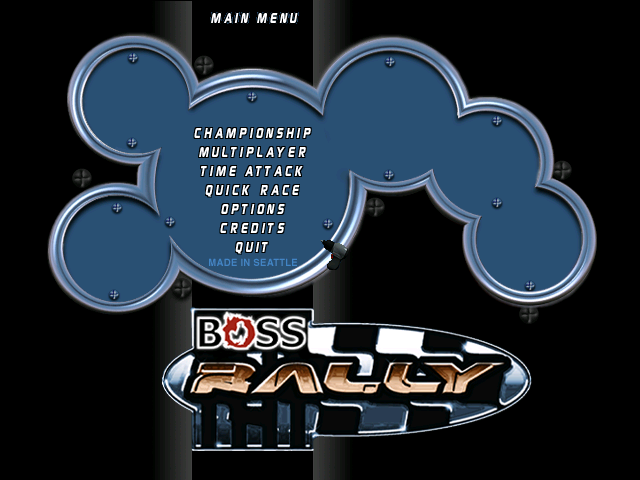
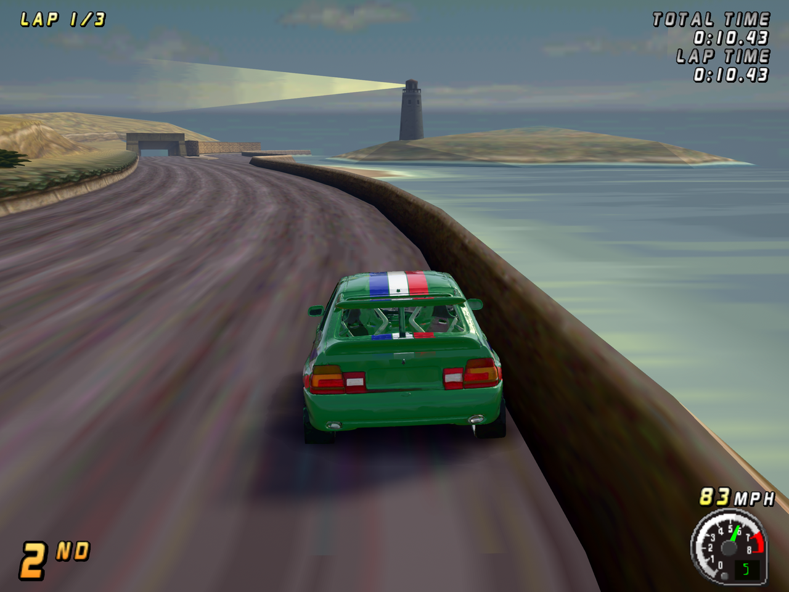
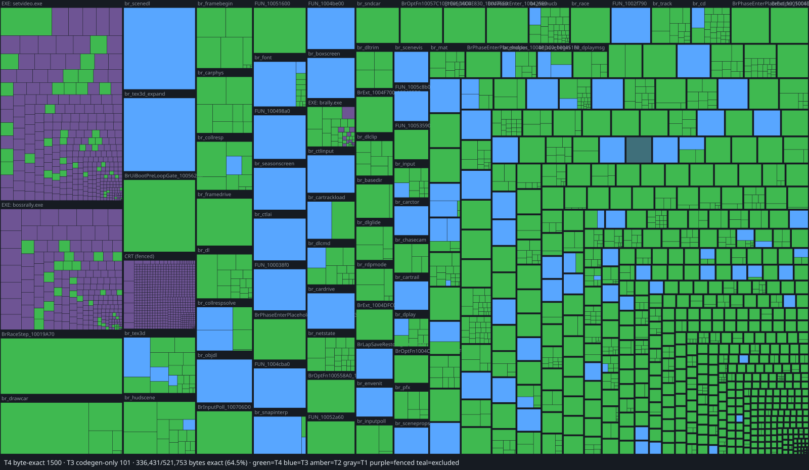
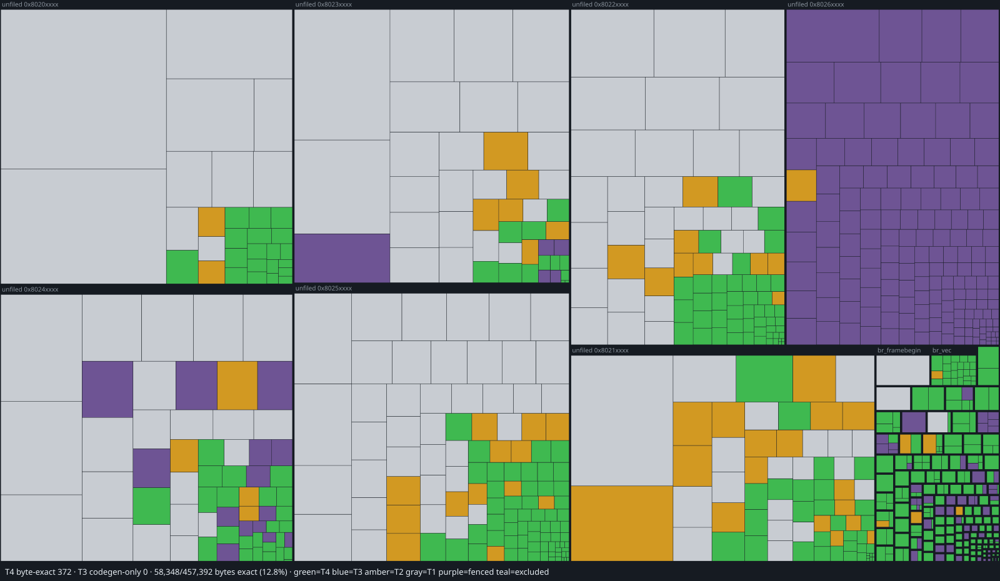

# Boss Rally / Top Gear Rally: byte-exact decompilation

<p>


</p>

*Left: the main menu, running natively on an Apple Silicon Mac ([Remastered Mac port](remaster.md)).
Right: Coastline with [Remastered lighting](remaster.md#remastered-lighting) and the
[Remastered car](remaster.md#remastered-car) on (press ~ to switch back to the original look).
The game also builds as a true 64-bit program for macOS, Windows and headless
use: see [Native port](#native-port-64-bit-cross-platform).*

**Maintainer:** Jeffrey Wilbur, Strut B, LLC\
**Contact:** [retro@strutb.com](mailto:retro@strutb.com)

## Project Purpose

A bit-exact decompilation of **Boss Rally** (PC, 1999), held to the MAME
standard: the C source is the single source of truth and must compile to
**byte-identical output** under the original compiler (MSVC 5.0), while the same
source also cross-compiles to modern platforms. One tree, two build targets (the
SM64 model). Progress is measured only in per-function byte-identical
equivalence; playability is a consequence, never a reason to reorder matching.
Do keep the port buildable.

## Game background

Boss Game Studios built *Top Gear Rally* for the N64 (1997), then shipped *Boss
Rally* for Windows (1999) on the same engine. The PC build still emits N64 F3DEX
display lists, ships N64-format textures and big-endian geometry off the disc,
and carries the ROM's diagnostic strings. The PC game ships two
renderer DLLs over one shared core: **`BRGlide.dll`** (3dfx Glide: the mature
target and the reference for all matching) and `BRD3D.dll` (Direct3D: statically
links Microsoft's CRT, so it's reference-only, out of scope).

## Two games, two decompilations

It's tempting to assume the N64 game is the PC game compiled for another
machine. It isn't. When the PC source is compiled for the N64 and compared
against the ROM, only about a fifth of the ROM's code has a clear match. At
most around half could turn out to share code with the PC game.

- **Boss Rally is the bigger game.** It has roughly twice as many game
  functions as Top Gear Rally. It's a later game built on the same engine, not
  a straight port.
- **Shared code still changed.** Where a function exists in both games, the
  two usually differ by a few percent of their instructions. Two years of
  edits sit between the 1997 and 1999 releases, so PC source is a strong
  starting point for an N64 function, not a finished answer.
- **Much of the ROM has no PC counterpart.** Around 40% is N64-only code:
  graphics and audio drivers, the front end and other console-specific
  systems. It has to be decompiled from scratch. Another sixth is Nintendo's
  system library and a compression library, which are linked in rather than
  decompiled.

So the N64 game gets its own decompilation, kept apart from the PC tree (see
[Top Gear Rally (N64) decompilation](#top-gear-rally-n64-decompilation)). The two still help each other. The
N64 compiler records operand order that the PC compiler throws away. A
matched function on either side is a head start on its twin.

## Current Status

Both decompilations count two milestones: M1, functions certified to behave
exactly like the original (T3) plus byte-exact ones (T4), and M2, byte-exact
functions only. The blocks below are snapshots; regenerate the bars and both
treemaps in one step with `python3 tools/progressbar.py`: do not hand-edit them.

### Boss Rally (PC)

<!-- PROGRESS:BEGIN: generated by tools/progressbar.py; do not edit by hand -->
_Snapshot 2026-10-04._

```
M1  Contract-valid: compiles & ports (T3 + T4)
    ████████████████████████████████████████  100.0%   450,489 / 450,649 B   1,495 / 1,495 fns
M2  Byte-exact (T4)
    ███████████████████████████░░░░░░░░░░░░░  66.7%   300,649 / 450,649 B   1,387 / 1,495 fns
```

| Area | M1: contract-valid | M2: byte-exact |
|---|---|---|
| **BossRally.exe** | `████████████████████` 100%: 35/35 fns, 2,482 B | `████████████████████` 100%: 35/35 fns, 2,482 B |
| **BRally.exe** | `████████████████████` 100%: 28/28 fns, 2,860 B | `████████████████████` 100%: 28/28 fns, 2,860 B |
| **SetVideo.exe** | `████████████████████` 100%: 42/42 fns, 7,251 B | `████████████████████` 100%: 42/42 fns, 7,251 B |
| **BRGlide.dll** | `████████████████████` 100.0%: 450,489 B, 1,495 fns | `█████████████░░░░░░░` 66.7%: 300,649 B, 1,387 fns |
<!-- PROGRESS:END -->



Every box is one function, sized by its bytes in `.text` and grouped by module:
green = byte-exact (T4, M2), blue = contract-valid but not yet byte-exact (T3),
amber = still diffing (T2), gray = not started (T1), purple = linker/CRT
(fenced). Green + blue is the M1 corpus. Regenerate: `python3
tools/progressmap.py --svg docs/progress-map.svg`.

### Top Gear Rally (N64)

<!-- N64-PROGRESS:BEGIN: generated by tools/progressbar.py; do not edit by hand -->
_Snapshot 2026-10-04._

```
M1  Contract-valid (T3 + T4)
    ████████████████████████████████████████  100.0%   374,936 / 374,936 B   567 / 567 fns
M2  Byte-exact (T4)
    ████████████████░░░░░░░░░░░░░░░░░░░░░░░░  39.1%   146,580 / 374,936 B   478 / 567 fns
```
<!-- N64-PROGRESS:END -->



Same map as the PC lane, over the ROM: one box per function, sized by its bytes
and coloured by tier (green = byte-exact, blue = contract-valid, amber = in
progress, gray = not started). Regenerate: `python3 n64/tools/n64map.py --svg
docs/progress-map-n64.svg`.

## More

- [cheats.md](cheats.md): the six hidden cheat codes the decompilation found in
  the PC game.
- [splitscreen.md](splitscreen.md): the PC game's complete but unreachable
  two-player split-screen renderer.
- [remaster.md](remaster.md): the 32-bit Mac port (wasm build) and its
  Remastered lighting, car, skies and music.

## Boss Rally (PC) decompilation

Both milestones are measured in bytes of the game's own functions in
BRGlide.dll: the hand-written target (in-scope EXE game code is separately
complete). The rest of the DLL's code section is itemised below.

<!-- PROGRESS-DETAIL:BEGIN: generated by tools/progressbar.py; do not edit by hand -->
**What the bars measure.** Both bars count the game's own functions in
BRGlide.dll: the code that has to be written by hand. M1 has complete.
M2 trails it by 108 functions (149,840 B) that are certified to behave exactly like
the original but do not yet compile to identical bytes.

**The rest of the DLL.** Its code section is 480,853 B; the bars leave out 30,204 B
of it, all of which the finished DLL still contains but none of which is
hand-written:

| Bytes | What it is | Where it comes from |
|---:|---|---|
| 20,151 | padding and jump tables between functions | emitted by the compiler with the functions |
| 7,975 | import stubs and C++ exception-handling glue | generated by the compiler and linker |
| 2,078 | 2 functions the retail game never runs | written, but left out of the count (config/excluded.csv) |

By binary: the three EXEs are complete at both milestones (their game code is fully
byte-exact; the static CRT filling out each image is reproduced by linking, not
decompiled, and is out of scope). All remaining work is in BRGlide.dll.
<!-- PROGRESS-DETAIL:END -->

Query the tree. Do not trust a number in this file.

```bash
.venv/bin/python tools/refcheck.py     # corpus must be Glide-keyed
.venv/bin/python tools/total.py        # byte-exact functions and bytes, all lanes
.venv/bin/python tools/tiers.py        # T1/T2/T3/T4 of the C target (bytes, not just fns)
.venv/bin/python tools/image_build.py  # M2 gate: assembled DLL vs original; must be 0 differing bytes AND 0 refslot findings
.venv/bin/python tools/image_build_t3.py  # M1 gate: T3+T4 all compile & place; only T3 bodies differ
.venv/bin/python tools/brbox_diff.py --all  # M1 behaviour gate: T3 image vs original, every script, every frame
.venv/bin/python tools/fileaudit.py    # WHAT IT DOES, filing, T3 tags
```

`image_build.py` is the Milestone-2 (byte-exact) gate; `image_build_t3.py` is
the Milestone-1 (contract-valid) one: it compiles every T3-certified function
as well and proves the whole corpus builds and places, emitting `BRGlide.T3.dll`.
Its T3 bodies differ in bytes by design, but it is a **working drop-in**: it runs
the retail game (tested in a Win98 VM under 86Box) and behaves identically to
the original on every scripted session (below).

T1 = draft only; T2 = in the tree, not done; T3 = certified complete, not
byte-exact (`tools/t3.py --qualify`); T4 = bytes diff clean.

### How T3 is verified

"Not byte-exact" must still mean "does exactly what the original does". Two
oracles run the **original game** headless (`tools/brbox.py`: the retail
`BRGlide.dll` under Unicorn, driven by input scripts in `tools/brbox_scripts/`:
boot, menus, quick race to the finish, time attack and saves, championship and
season save/load, options and video modes, cheats and credits, a force-feedback
wheel, CD music, and two-machine DirectPlay races with join and dropout):

- **A5: per function** (`tools/t3live.py`, ledger `config/t3_live.csv`): at
  real calls in the running game, the original body and the T3 body run from the
  identical captured state; memory, imports, registers, x87 state and live
  return values must agree. Unreached functions are UNCOVERED, never passed.
- **A7: whole image** (`tools/brbox_diff.py --all`, ledger
  `config/whole_image.csv`): the assembled `BRGlide.T3.dll` and the original run
  every script side by side and must agree on **every frame**: every Glide call
  and its arguments, the whole data area, and every network packet (both
  machines of a network session run the image under test). Currently 26/26
  scripts identical.

A7 exists because A5 alone was not enough: the whole-image run found some 25
real transcription bugs (inverted branches, swapped or wrong arguments,
off-by-one indexing, x87 rounding points, and image-builder relocation errors)
in functions A5 had certified. `t3.py --qualify` requires both, and A7 is never
superseded. Bytes the original itself reads without ever writing (stale stack)
are listed with their evidence in `config/ub_scrub.csv` and neutralised on both
sides. Function counts
overstate progress: remaining functions are several times larger than matched
ones. Quote bytes with their denominator (the hand-written target shown in the
bars, or BRGlide `.text` at 480,853 B: say which).

In-scope EXE game code (BRally.exe, BossRally.exe, SetVideo.exe) is complete;
what remains in those images is statically-linked CRT, reproduced by linking.
C++ EH functions are a separate lane (`tools/cpp_sweep.py`). The Mac port is
described in [remaster.md](remaster.md).

A byte-exact session picks targets with `python3 tools/t4lane.py --claim`
(Pool B). Procedure: `docs/MATCHING.md`.

The image gate (`tools/image_build.py`) is the deliverable check a per-function
diff cannot perform: it lays every claim at the address it claims, refuses
overlaps, fills unmatched ranges from the original, and diffs the image.

### Keeping it that way

A function is not done until it says what it does and lives in its module.
`tools/precommit_rule6.py` refuses a commit that adds an `@implements` without
a `WHAT IT DOES:` comment, creates a `sliceN_MM.c`, or adds a new VA to an
existing address batch. `tools/fileaudit.py` is a ratchet across all three
lanes (undescribed 0, batches 58, stranded 11) and fails on a bad `@t3` tag.
After a refile: `python3 tools/portcheck.py --baseline main`: the sweep only
compiles `/DBR_MATCHING_BUILD`. Moving byte-exact code can change it; sweep
both files and keep the move only if nothing regressed.

### Architecture

The repo root is the decomp. `ports/` is derived platform code, not byte-matched.

    src/core/                 portable game logic (byte-matched)
    src/backends/{glide,d3d,win32}   original Win9x platform layer
    src/exe/                  the three Win9x executables (game code done)
    include/  tests/
    tools/                    matching pipeline + staged MSVC 5.0
    config/                   function maps, globals, binaries.csv, fenced.csv
    build/match/              extracted reference bytes, per-function report
    ports/brally/                the native 64-bit port: a retyped fork of the core
                              plus a cross-platform layer (macOS, Windows)
    ports/macos/              macOS/Metal 32-bit lane: NEW code, no `@implements`
    n64/                      Top Gear Rally (IDO/MIPS); writes only build/n64/

`@implements <addr>` is a hard claim: MSVC 5.0 emits those original bytes.
The engine is dispatch-driven: only ~13% is reachable by following `call`
from the entry point, so functions are taken leaves-first.

Further reading: [ARCHITECTURE.md](ARCHITECTURE.md), [docs/MATCHING.md](docs/MATCHING.md),
[docs/VC5-IDIOMS.md](docs/VC5-IDIOMS.md), `ports/README.md`.

### Building & Setup

- **`./setup.sh`**: stages the matching build entirely inside the repo (nothing
  installed on the host). Downloads a pinned Wine build, copies MSVC 5.0 out of a
  VC++ 5.0 disc image, and extracts the game binaries and original function bytes
  from the retail disc. Needs (you supply; none tracked in git): `reference/msvc/VCPP-5.00.iso`,
  the Boss Rally disc (`reference/brally/BossRally.BIN` + `.cue`), optionally the
  [Top Gear Rally ROM](#reference-rom-you-supply-not-tracked-in-git), plus Rosetta 2 on Apple Silicon.

- **`sh build_match.sh`**: compiles with the original compiler and diffs; each
  function reports MATCH or DIFF with the first divergence. `tools/pe_patch.py`
  patches matches back into the DLL for drop-in testing.
- **`./build.sh`**: builds the portable core natively with clang, with its unit
  tests and the older partial harness `build/brally`. Modules and tests are
  auto-discovered. `./tools/regress.sh` runs every suite. The playable
  builds are separate: the [native port](#native-port-64-bit-cross-platform)
  (macOS, Windows, headless) and the [Remastered Mac port](remaster.md)'s 32-bit lane.

### Reference data (you supply; none tracked in git)

These are the exact dumps the match counts were produced against: `setup.sh`
checks the MD5s and warns if a different image is in `reference/`.  Without
them the tree still builds and the suites that need retail data skip with a
reason, but the matching pipeline cannot run and no byte-exact claim can be
verified.

```
reference/msvc/VCPP-5.00.iso                  Visual C++ 5.0 disc image
reference/brally/BossRally.BIN                retail PC disc
    MD5  31c64f9b1e09788c2dfc384b44af8f6c     616,572,096 bytes (MODE1/2352)
reference/brally/BossRally.cue                cue sheet (data + 12 audio tracks)
    MD5  a48a4a5860558177c3041afee57e03c9     622 bytes
```

Rosetta 2 is required on Apple Silicon (the Wine build is x86_64). `setup.sh`
pulls `BRD3D.dll`, `BRGlide.dll` and the other game binaries out of the BIN
into `orig/`: do not copy them by hand. Assets are extracted from the same
images and never committed or redistributed; without them the tree still
builds and the suites that need retail data skip with a reason.

## Top Gear Rally (N64) decompilation

A second, separate decompilation lives in `n64/`: *Top Gear Rally* (N64,
1997), matched byte for byte against the retail ROM under SGI's IDO 5.3
compiler. It keeps its own sources, headers, symbols and tools, so nothing in
it touches the PC work. It follows the same T1-T4 tiers and the same two
milestones. M1 counts functions certified as behaving exactly like the
original (T3) plus byte-exact ones (T4). M2 counts byte-exact functions only.

The denominator is the ROM's game-code functions. Nintendo's system library and
the compression library are fenced out as each of their functions is identified,
the way the PC lane excludes Microsoft's C runtime, so the count shrinks as more
library code is recognised.

```bash
.venv/bin/python n64/tools/n64tiers.py     # tiers and milestones, rebuilt fresh
.venv/bin/python n64/tools/n64build.py     # compile n64/src and grade every function
n64/tools/n64ghidra.sh                     # machine drafts (T1) for every ROM function
```

A byte-exact grade is strict: every instruction must match, and every address
a function uses must point where the ROM's does. Strings, float constants and
jump tables are checked by their contents in the ROM.

### How N64 T3 is verified

The same two oracles as the PC lane, over the original ROM: `n64/tools/n64box.py`
runs the retail cartridge headless under Unicorn (MIPS), with the operating
system, the controllers, a Controller Pak and a Rumble Pak modelled and
everything else executed for real. **A5** (`n64/tools/n64t3.py`, ledger
`n64/config/t3_live.csv`) replays each T3 body against the original at real
calls; **A7** (`n64t3.py --image`, ledger `n64/config/whole_image.csv`) runs
the whole image with every T3 body placed and must agree on every frame:
every display list and audio task, and the game's RAM.

Both are only as good as the play they see, so the 60 input scripts in
`n64/tools/n64box_scripts/` cover the game broadly: all ten tracks (mirrors
included) across all five weathers, all 13 cars and every setup option, one
and two players, arcade, time attack, practice and championship (one race
driven all three laps to the flag, through the instant replay and results),
the camera views, all five controller layouts, the cheat codes, the credits
demos, the paint shop and the Controller and Rumble Paks. Most are written by
`n64/tools/n64drive.py`, which plays the ROM toward a plan: menu rows, cheats,
cars, then a race on the computer drivers' own racing line, and records the
pad as a script that replays identically. `n64/tools/n64probe.py --cover`
reports which functions the scripts reach: 373 of the 439 byte-exact
functions, and every T3.

```bash
.venv/bin/python n64/tools/n64probe.py SCRIPT       # what a script does: screens, rows, race setup
.venv/bin/python n64/tools/n64probe.py --cover      # functions the suite reaches, by tier
.venv/bin/python n64/tools/n64drive.py list         # the generated plans
.venv/bin/python n64/tools/n64drive.py verify --all # every generated script replays its recording
```

### Reference ROM (you supply; not tracked in git)

```
reference/tgrally/Top Gear Rally (USA).z64    Top Gear Rally ROM (optional; the Mac app needs it)
    MD5  6f7030284b6bc84a49e07da864526b52     8,388,608 bytes (big-endian, NGRE)
```

`setup.sh` treats it as optional because the PC decompilation does not need
it; the N64 decompilation is graded against it, and the Mac app reads its music
modules for the N64 soundtrack.

## Native port (64-bit, cross-platform)

`ports/brally/` is the game as a real 64-bit program: native pointers, typed
structures, no emulated address space and no image of the original DLL mapped
at its old addresses. One portable core is built once for every OS, with a
thin platform layer under it, and it plays the whole game: the front end,
every race mode and weather, saves, the championship, replays, music and
sound, controllers and network multiplayer.

| OS | window and input | renderer | status |
|---|---|---|---|
| macOS (arm64) | Cocoa, GameController | Metal (or Vulkan on MoltenVK) | plays; `Boss Rally 64.app` |
| Windows (x64) | Win32, XInput | Vulkan | builds (cross-compiled); a `.exe` |
| any (headless) | scripted input | software reference rasteriser, or none | the test suites |

**How the core is made.** `ports/brally/src` and `ports/brally/include` are a
one-time copy of the decomp (the commit in `src/FORKED-FROM`), edited
directly. Every function is certified to behave as the original does, so the
copy is retyped for 64 bits rather than regenerated: raw 32-bit offsets and
strides became named fields, pointers kept in `int` became pointers, every
original address became one definition with the original's other names for
it as views of that one object, and N64-format disc data keeps its 4-byte
address slots through one accessor. The initial data is lifted from your
`BRGlide.dll` at build time (`tools/datalift.py`); the core never includes the
MSVC 5.0 SDK headers. `src/` and `include/` stay exactly what MSVC 5.0
compiles, and later byte-matching there never has to flow into the copy.
`ports/brally/PORTABLE-CORE.md` has the design.

**Verified against the original.** Under `BR_VCLOCK` the native build and the
32-bit lane run the same input scripts on one virtual clock, and the car
state is compared tick for tick: they are identical across quick races, every
weather, the cheat tracks, time attack, the championship and season saves.
Network races are checked against brbox, the original DLL run in an
emulator, frame for frame. Rendering is checked the same way, renderer
against renderer and against the reference.

**The platform layer** (`ports/brally/platform/`) answers what the game asks of
Windows, by API, not by OS:

| Directory | What it is |
|---|---|
| `common/` | Win32 (windows, messages, files, threads, timers), DirectInput, DirectSound (mixed natively), MCI and EAR CD audio, DirectPlay over UDP, Glide 2, the C runtime with the game's DOS paths |
| `render/` | one renderer interface, neutral between graphics APIs: Metal, Vulkan, a software reference rasteriser, and a null one |
| `host/` | per OS: the window, keys, mouse, pads, audio out, files (`macos`, `windows`, `win32`, `posix`, `null`) |
| `include/` | the Win32, DirectX and Glide surface the core compiles against, in fixed-width types |

Glide is modelled on the Voodoo: 16-bit W-buffer depth (which the car shadows
depend on), back-face culling, its combiners, fog and texture formats. Every
renderer draws at the window's own resolution, one pixel per window pixel,
as the original drew at the resolution the player chose, and LFB images are
scaled with sharp bilinear.

**Original and Remastered.** Every place where the port can either behave as
the 1999 game did or improve on it is one flag, and two profiles set them
all (`platform/include/br_flags.h`):

| Flag | Original | Remastered |
|---|---|---|
| `ANY_ASPECT` | the game's 4:3 picture, letterboxed or pillarboxed | any window shape: the race fills it, its camera widened (Hor+ in a wide window, Vert+ in a tall one), the mirror and HUD kept at their own shape at their edges |
| `MENU_MUSIC_RESUME` | music paused by a focus change stays paused in the menus | it resumes |

Tab switches between the two in play. It is the game's own 29th control,
**REMASTER** on the Game Key Configuration page, so it can be rebound like
any other; its binding is saved after the original's settings in
`BossRally.cfg`, which the original game still reads. `BR_PROFILE=original`
starts in Original, and `BR_FLAG_<NAME>=0|1` overrides one flag. The 32-bit
lane's Remastered lighting, car, skies and music
([remaster.md](remaster.md)) have not moved over yet.

**Multiplayer** is DirectPlay over UDP: a host advertises on the LAN by
multicast and relays the session; any copy on the network can join from the
game's own lobby. `BR_NETPORT` picks the port (47624 by default).

**Building.** `ports/brally/link64.sh` builds the core and links one host and
one renderer, chosen by environment:

```sh
# macOS, Metal: build/portable_metal/brally64
OUT=build/portable_metal HOST=macos RENDER=metal ports/brally/link64.sh

# macOS app: build/app64/Boss Rally 64.app, with the disc's data and CD audio
# inside (needs reference/brally/ and ffmpeg)
ports/brally/package_app.sh

# Windows x64, Vulkan, cross-compiled (Homebrew's mingw-w64, vulkan-headers,
# vulkan-loader, glslang): build/portable_winvk/brally64.exe
OUT=build/portable_winvk HOST=windows RENDER=vulkan CC=ports/brally/tools/wincc.sh ports/brally/link64.sh

# headless, the software reference renderer: build/portable/brally64
RENDER=soft ports/brally/link64.sh
```

The build reads the game data from your disc: `BR_CDROOT` is the CD's files
(default `testdata/disc`, else beside the program or inside the app),
`BR_SAVEDIR` the saves and settings (default `~/Library/Application
Support/Boss Rally 64` on macOS, `%APPDATA%\Boss Rally 64` on Windows). On
Windows, put the disc's files in `disc\` beside `brally64.exe`.

**Testing.** `ports/brally/tools/suite.sh` runs every `tools/brbox_scripts/`
scenario headless and reports each script's outcome, network pairs included
(two copies on one virtual clock); `BR_SHOT` and the scripts' `shot` lines
save named frames.
